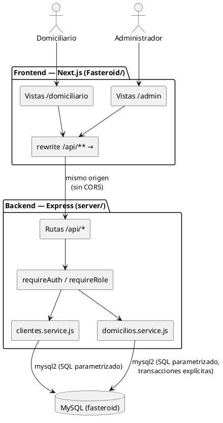
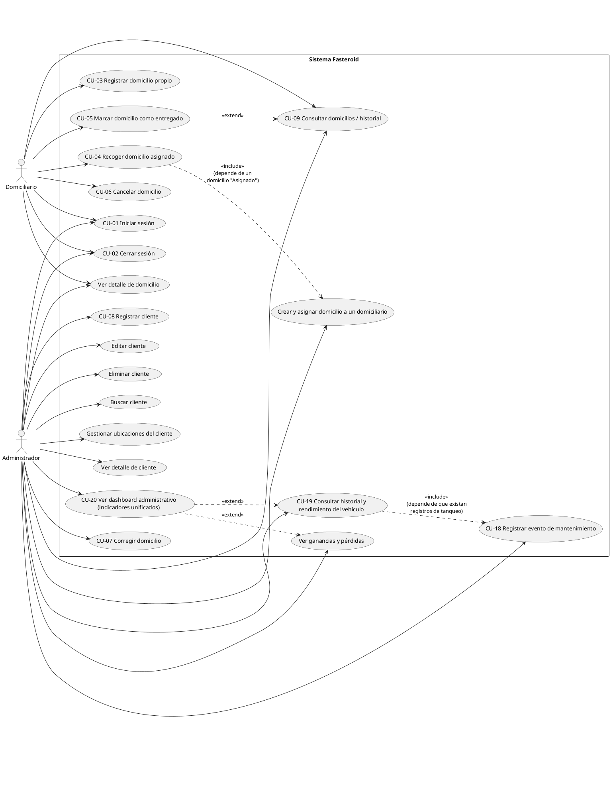
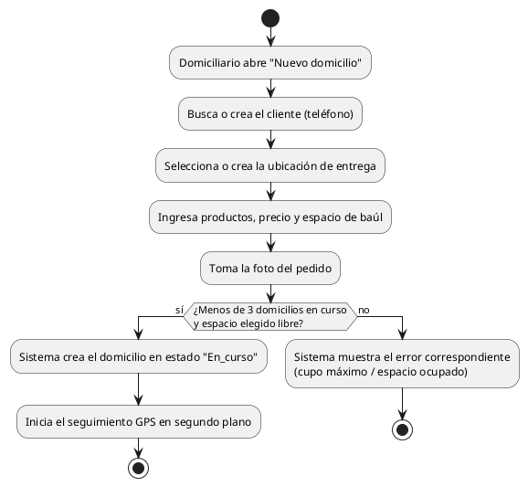
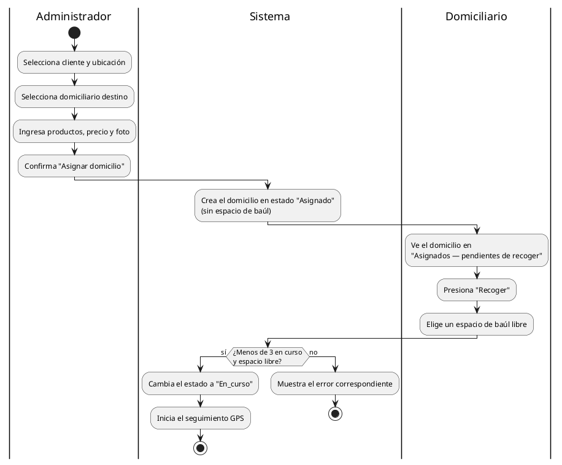
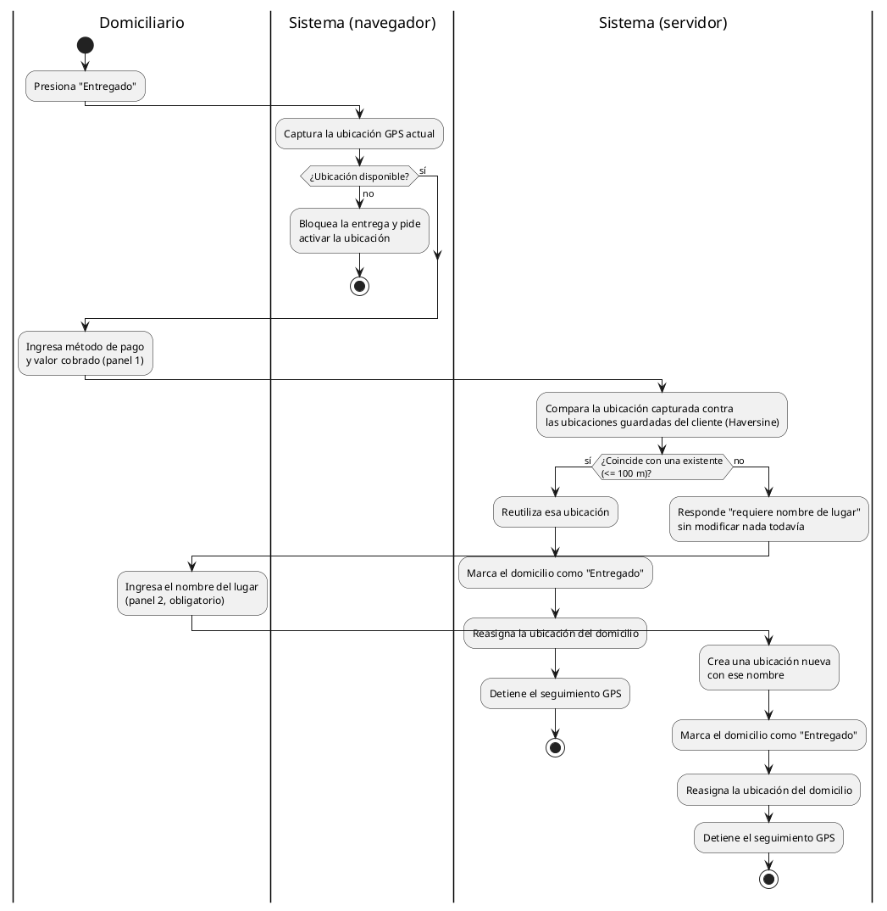
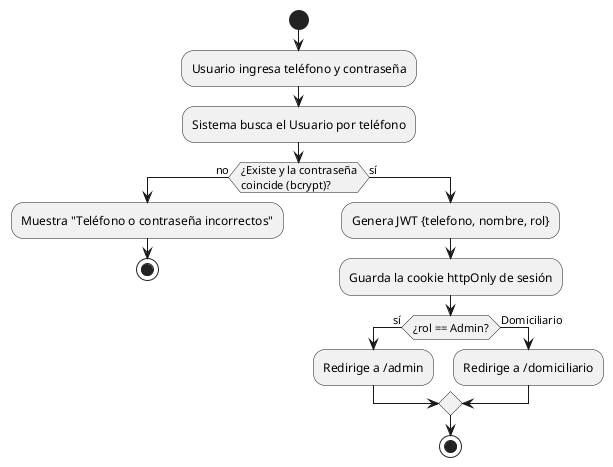
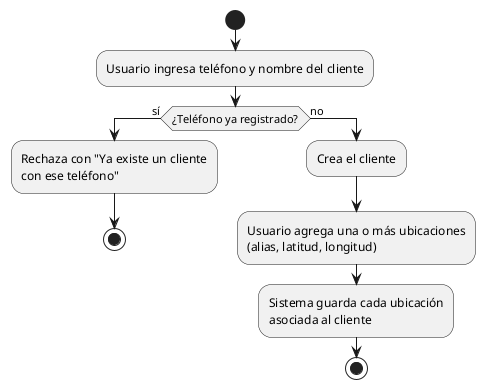
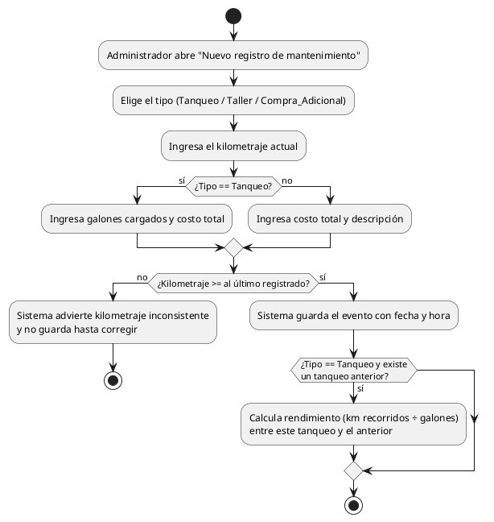

# Especificación de Requisitos de Software — Fasteroid

> **Proyecto:** Fasteroid — Sistema de gestión de domicilios (Carepa, Antioquia)
> **Documento base:** [`proyecto-unificado.md`](proyecto-unificado.md) (visión, alcance y backlog) y
> [`databases.plantuml`](databases.plantuml) (modelo de datos), contrastados contra el código fuente
> real en `Fasteroid/` al momento de escribir este documento.
> **Metodología documental:** estructura de Especificación de Requisitos de Software (ERS) e ingeniería
> de requerimientos basada en escenarios (casos de uso) y en el comportamiento (diagramas de actividad),
> según Roger S. Pressman, *Ingeniería del Software: un enfoque práctico*, 7.ª edición, McGraw-Hill.
> **Versión:** 1.5 (Fase 3 completa: rentabilidad por domicilio, alertas de mantenimiento preventivo y
> exportes CSV/PDF — RF-49 a RF-51 nuevos; corregido RF-47/Maps, que seguía marcado "Pendiente" pese a
> estar implementado desde el 2026-08-23. Con esto el planteamiento original completo del proyecto
> queda implementado) · **Fecha:** 2026-09-04 · **Autor:** Equipo Fasteroid (documentado con asistencia
> de Claude Code)

---

## Índice

1. [Introducción](#1-introducción)
2. [Descripción general del sistema](#2-descripción-general-del-sistema)
3. [Requisitos específicos](#3-requisitos-específicos)
4. [Requerimientos de usuario](#4-requerimientos-de-usuario)
5. [Casos de uso](#5-casos-de-uso)
6. [Actividades de uso (diagramas de actividad)](#6-actividades-de-uso-diagramas-de-actividad)
7. [Modelo de datos (resumen)](#7-modelo-de-datos-resumen)
8. [Matriz de trazabilidad](#8-matriz-de-trazabilidad)
9. [Estado de implementación frente al alcance planeado](#9-estado-de-implementación-frente-al-alcance-planeado)
10. [Escalabilidad y manejo de fallos](#10-escalabilidad-y-manejo-de-fallos)

---

## 1. Introducción

### 1.1 Propósito

Este documento especifica, en un solo lugar y con trazabilidad hacia el código fuente, los requisitos
funcionales y no funcionales, los requerimientos de usuario, los casos de uso y las actividades de uso
del sistema **Fasteroid**. Sirve como referencia para desarrollo, pruebas y evaluación académica del
proyecto bajo el enfoque de ingeniería de requerimientos de Pressman (7.ª ed.).

### 1.2 Alcance del producto

Fasteroid es un sistema web (con una vista optimizada para celular, tipo PWA) que centraliza la gestión
de domicilios de un negocio de reparto en Carepa, Antioquia. Cubre: autenticación por rol, registro y
consulta de clientes con sus ubicaciones, ciclo de vida completo de un domicilio (creación, asignación,
recogida, seguimiento GPS, entrega, cancelación, corrección), navegación con deep link a Google Maps,
un panel administrativo con historial, comparación de ganancias/pérdidas y un
dashboard mensual unificado, el módulo de mantenimiento del vehículo (tanqueos, taller, compras
adicionales, rendimiento km/galón, alertas preventivas), rentabilidad por domicilio, exportes
descargables (CSV/PDF), y el escaneo de comandas por OCR. Con esto quedan cubiertas las Fases 1, 2 y 3
completas del planteamiento original (ver sección 9).

### 1.3 Definiciones, acrónimos y abreviaturas

| Término | Significado |
|---|---|
| Domicilio | Un pedido a domicilio, desde que se registra hasta que se entrega o cancela |
| Domiciliario | Usuario que reparte los pedidos en moto; rol operativo del sistema |
| Administrador (Admin) | Usuario dueño/gestor del negocio; rol de supervisión y asignación |
| Espacio del baúl | Uno de los 3 compartimentos físicos de la moto donde se transporta un pedido |
| Estado "Asignado" | Domicilio creado por el Admin, todavía sin recoger ni espacio de baúl |
| Estado "En_curso" | Domicilio recogido, con tracking GPS activo |
| GPS | Sistema de posicionamiento global, obtenido vía `navigator.geolocation` del navegador |
| Haversine | Fórmula matemática para calcular distancia entre dos coordenadas GPS |
| JWT | JSON Web Token, usado para la sesión de usuario |
| PWA | Progressive Web App |
| RF / RNF | Requisito Funcional / Requisito No Funcional |
| RU | Requerimiento de Usuario (historia de usuario) |
| CU | Caso de Uso |
| DA | Diagrama de Actividad |

### 1.4 Referencias

- Pressman, R. S. *Ingeniería del Software: un enfoque práctico*, 7.ª edición, McGraw-Hill, 2010
  (capítulos de ingeniería de requerimientos, modelado basado en escenarios y modelado del
  comportamiento).
- [`proyecto-unificado.md`](proyecto-unificado.md) — documento de visión, alcance por fases y backlog.
- [`databases.plantuml`](databases.plantuml) — diagrama entidad-relación vigente.
- Código fuente del proyecto: `Fasteroid/` (frontend, Next.js 16) y `server/` (backend, Express +
  MySQL). Backend anterior (Next.js + Prisma 7 + SQLite) archivado en
  `backend-legado-nextjs-prisma-sqlite/`.

### 1.5 Visión general del documento

La sección 2 describe el sistema y sus usuarios a alto nivel. La sección 3 detalla los requisitos
funcionales y no funcionales verificables. La sección 4 traduce esos requisitos al lenguaje del usuario
(historias de usuario). La sección 5 desarrolla los casos de uso con sus flujos. La sección 6 presenta
diagramas de actividad de los procesos más relevantes. Las secciones 7 a 9 cierran con el modelo de
datos, la trazabilidad entre requisitos/casos de uso y el estado real de implementación.

---

## 2. Descripción general del sistema

### 2.1 Perspectiva del producto

**Actualizado (2026-08-23):** el sistema se compone de dos servicios separados — un frontend Next.js y
un backend Express propio — más una base de datos MySQL. No depende de APIs de pago de mapas ni de
servicios de OCR en la nube en su versión actual.

- **Frontend** (`Fasteroid/`, Next.js 16 App Router): sirve tanto el panel del Administrador
  (`/admin/*`) como la vista del Domiciliario (`/domiciliario/*`), pensada para instalarse como PWA en
  el celular del domiciliario. No accede a la base de datos ni conoce el secreto de sesión — todo
  `/api/**` se reenvía (`rewrites()` en `next.config.mjs`) al backend Express, de forma transparente
  para el navegador (mismo origen, sin CORS).
- **Backend** (`server/`, Express + `mysql2`): único punto de acceso a la base de datos y única
  autoridad de sesión (JWT firmado con `jose`, cookie `httpOnly`, contraseñas con `bcrypt`). Sin ORM:
  cada función de servicio (`modules/<feature>/*.service.js`) escribe el SQL parametrizado a mano
  contra un *connection pool* de `mysql2`, con transacciones explícitas donde una operación necesita
  varios pasos atómicos (ver sección 3.3, RNF de manejo de fallos).
- **Base de datos**: **MySQL**, con las reglas de negocio críticas reforzadas a nivel de esquema
  (`ENUM`, `CHECK`, un índice único con una columna generada — ver `server/db/schema.sql`).
- Hasta el 2026-08-23 el backend era rutas de API de Next.js + Prisma ORM + SQLite; esa versión se
  archivó completa (sin borrar) en
  [`backend-legado-nextjs-prisma-sqlite/`](backend-legado-nextjs-prisma-sqlite/), con instrucciones de
  restauración, por si hace falta volver atrás.

### 2.2 Funciones del producto

En su estado actual, el sistema permite:

1. Autenticar usuarios por teléfono/contraseña y separar el acceso por rol.
2. Registrar clientes y sus múltiples ubicaciones.
3. Crear domicilios, ya sea por el propio domiciliario o por el Administrador asignándolos.
4. Recoger un domicilio asignado, eligiendo el espacio del baúl.
5. Hacer seguimiento GPS de un domicilio en curso y calcular la distancia recorrida.
6. Marcar un domicilio como entregado, verificando y corrigiendo automáticamente la ubicación del
   cliente con base en la posición real de entrega.
7. Cancelar un domicilio con motivo.
8. Consultar domicilios activos e históricos, con filtros por período.
9. Corregir productos y precio de un domicilio ya creado (rol Admin).
10. Visualizar una comparación de ganancias y pérdidas por período.

### 2.3 Clases y características de los usuarios (actores)

| Actor | Dispositivo típico | Perfil | Nivel de acceso |
|---|---|---|---|
| **Domiciliario** | Celular (navegador, PWA) | Encargado de repartir los pedidos; puede no tener alta alfabetización digital, necesita una interfaz simple y rápida de usar en movimiento | Solo sus propios domicilios (creados por él o asignados a él) |
| **Administrador** | Computador (navegador de escritorio) | Dueño o gestor del negocio; necesita visión completa de la operación | Todos los domicilios y clientes; asignación y corrección |

No existen usuarios anónimos ni autorregistro: las cuentas las crea el Administrador directamente en la
base de datos (`server/db/seed.js` en el estado actual del proyecto).

### 2.4 Restricciones

- No se utilizan APIs de pago (Google Maps, OCR en la nube) en la fase actual del proyecto.
- El cálculo de distancia recorrida depende de la disponibilidad de la API de geolocalización del
  navegador (`navigator.geolocation`), que algunos navegadores móviles limitan en segundo plano.
- La base de datos es MySQL, servida localmente durante el desarrollo. A diferencia de SQLite (usado
  antes de la migración), MySQL sí soporta `ENUM` nativo, pero no soporta índices únicos parciales —
  la regla de un espacio de baúl por domiciliario activo se reproduce con una columna generada
  (`espacio_activo`), ver `server/db/schema.sql`.
- El sistema opera hoy con un solo domiciliario y una sola moto (con un baúl de 3 espacios), aunque el
  modelo de datos soporta múltiples domiciliarios sin cambios estructurales.

### 2.5 Supuestos y dependencias

- El domiciliario cuenta con un celular con GPS y cámara funcionales, y con conexión a internet
  disponible en el momento de operar (el modo sin conexión es un requisito no funcional identificado
  pero **no implementado**, ver RNF-15).
- El Administrador opera desde un navegador con soporte de JavaScript moderno.
- Los datos de clientes (teléfono, ubicaciones) son reales y están sujetos a normativa de protección de
  datos personales.

---

## 3. Requisitos específicos

### 3.1 Requisitos de interfaces externas

| Tipo | Descripción |
|---|---|
| Interfaz de usuario | Interfaz web responsiva (móvil / tablet / escritorio), formularios validados con `react-hook-form`, modales y confirmaciones con `SweetAlert2`, iconografía con `lucide-react`, modo claro/oscuro según preferencia del sistema operativo |
| Interfaz de hardware | Cámara del celular (captura de foto del pedido), GPS del celular (seguimiento y captura de ubicación de entrega) |
| Interfaz de software | Navegador con soporte de la API `Geolocation` y `FileReader`/`<input type="file">`; no se integra con software de terceros en el estado actual |
| Interfaz de comunicación | HTTP(S) entre el navegador y las rutas de API internas de Next.js (`/api/*`); no hay integraciones externas activas |

### 3.2 Requisitos funcionales

Cada requisito se identifica como **RF-NN**, con su estado real: **Implementado** o **Pendiente**
(planeado en `proyecto-unificado.md` pero no construido aún).

#### Autenticación y control de acceso

| ID | Descripción | Estado |
|---|---|---|
| RF-01 | El sistema debe permitir iniciar sesión mediante número de teléfono y contraseña. | Implementado |
| RF-02 | El sistema debe validar las credenciales contra la contraseña cifrada (bcrypt) del usuario, sin almacenar contraseñas en texto plano. | Implementado |
| RF-03 | El sistema debe emitir una sesión mediante un token JWT firmado, con vigencia de 7 días, transportado en una cookie `httpOnly`. | Implementado |
| RF-04 | El sistema debe redirigir a cada usuario autenticado a la vista correspondiente a su rol (`/admin` o `/domiciliario`). | Implementado |
| RF-05 | El sistema debe restringir el acceso a `/admin/*` exclusivamente al rol Administrador y a `/domiciliario/*` exclusivamente al rol Domiciliario, tanto en páginas como en rutas de API. | Implementado |
| RF-06 | El sistema debe permitir cerrar sesión, invalidando la cookie de sesión, con confirmación previa del usuario. | Implementado |

#### Gestión de clientes

| ID | Descripción | Estado |
|---|---|---|
| RF-07 | El sistema debe permitir registrar un cliente con teléfono (identificador único) y nombre, ambos obligatorios. | Implementado |
| RF-08 | El sistema debe impedir registrar dos clientes con el mismo número de teléfono. | Implementado |
| RF-09 | El sistema debe permitir buscar clientes por coincidencia parcial de nombre o teléfono. | Implementado |
| RF-10 | El sistema debe permitir editar el nombre de un cliente existente. | Implementado |
| RF-11 | El sistema debe permitir eliminar un cliente, siempre que no tenga domicilios asociados. | Implementado |
| RF-12 | El sistema debe permitir asociar múltiples ubicaciones (alias, latitud, longitud) a un mismo cliente. | Implementado |
| RF-13 | El sistema debe permitir eliminar una ubicación de un cliente, siempre que no tenga domicilios asociados. | Implementado |
| RF-14 | El sistema debe mostrar, en el detalle de un cliente, sus ubicaciones registradas y el número de domicilios/ubicaciones asociados. | Implementado |

#### Domicilios — creación y asignación

| ID | Descripción | Estado |
|---|---|---|
| RF-15 | El sistema debe permitir a un Domiciliario registrar un domicilio propio con cliente, ubicación, productos, precio, espacio de baúl (1 a 3) y fotografía del pedido. | Implementado |
| RF-16 | El sistema debe exigir un precio mayor a cero al crear cualquier domicilio. | Implementado |
| RF-17 | El sistema debe exigir la fotografía del pedido como campo obligatorio al crear un domicilio. | Implementado |
| RF-18 | El sistema debe impedir que un domiciliario tenga más de 3 domicilios en curso simultáneamente. | Implementado |
| RF-19 | El sistema debe impedir que dos domicilios en curso del mismo domiciliario ocupen el mismo espacio del baúl. | Implementado |
| RF-20 | El sistema debe permitir al Administrador crear un domicilio y asignarlo a un domiciliario específico, sin elegir el espacio del baúl. | Implementado |
| RF-21 | El sistema debe registrar en estado "Asignado" (sin espacio de baúl) los domicilios creados por el Administrador, hasta que el domiciliario los recoja. | Implementado |
| RF-22 | El sistema debe validar que la ubicación indicada al crear un domicilio pertenezca al cliente seleccionado. | Implementado |

#### Domicilios — recogida

| ID | Descripción | Estado |
|---|---|---|
| RF-23 | El sistema debe permitir al domiciliario ver los domicilios "Asignados" pendientes de recoger. | Implementado |
| RF-24 | El sistema debe permitir al domiciliario elegir el espacio del baúl al recoger un domicilio "Asignado", aplicando las mismas validaciones de cupo (RF-18, RF-19). | Implementado |
| RF-25 | El sistema debe cambiar el estado del domicilio de "Asignado" a "En_curso" al recogerlo, e iniciar el seguimiento GPS. | Implementado |

#### Domicilios — seguimiento y entrega

| ID | Descripción | Estado |
|---|---|---|
| RF-26 | El sistema debe registrar la posición GPS del domiciliario a intervalos mientras un domicilio está "En_curso" y acumular la distancia recorrida mediante la fórmula de Haversine. | Implementado |
| RF-27 | El sistema debe exigir la captura de la ubicación GPS del domiciliario como condición obligatoria para confirmar la entrega de un domicilio. | Implementado |
| RF-28 | El sistema debe permitir registrar el método de pago (Efectivo/Transferencia) y el valor cobrado al marcar un domicilio como entregado. | Implementado |
| RF-29 | El sistema debe comparar la ubicación capturada al entregar contra las ubicaciones guardadas del cliente (Haversine, umbral de 100 m) y reutilizar la existente si coincide. | Implementado |
| RF-30 | El sistema debe solicitar un nombre de lugar obligatorio y crear una ubicación nueva del cliente cuando la ubicación capturada al entregar no coincide con ninguna existente. | Implementado |
| RF-31 | El sistema debe reasignar la ubicación del domicilio a la ubicación resultante de la entrega (existente o nueva), reemplazando la que tenía al crearse. | Implementado |
| RF-32 | El sistema debe registrar la fecha y hora de entrega y detener el seguimiento GPS al marcar el domicilio como entregado. | Implementado |

#### Domicilios — cancelación

| ID | Descripción | Estado |
|---|---|---|
| RF-33 | El sistema debe permitir cancelar un domicilio en curso, exigiendo un motivo de cancelación obligatorio. | Implementado |
| RF-34 | El sistema debe registrar la fecha y hora de cancelación. | Implementado |

#### Domicilios — consulta y corrección

| ID | Descripción | Estado |
|---|---|---|
| RF-35 | El sistema debe permitir al domiciliario consultar sus domicilios en curso y su historial, filtrado por día, semana o mes. | Implementado |
| RF-36 | El sistema debe permitir al Administrador consultar los domicilios en curso, asignados e históricos de todos los domiciliarios. | Implementado |
| RF-37 | El sistema debe mostrar el detalle completo de un domicilio (cliente, ubicación, productos, precio, estado, espacio de baúl, domiciliario, fechas, distancia, pago). | Implementado |
| RF-38 | El sistema debe restringir la visualización del detalle de un domicilio al domiciliario asignado o al Administrador. | Implementado |
| RF-39 | El sistema debe permitir al Administrador corregir los productos y el precio de un domicilio ya creado, sin permitir modificar cliente, ubicación, domiciliario asignado ni espacio del baúl. | Implementado |

#### Panel administrativo y reportes

| ID | Descripción | Estado |
|---|---|---|
| RF-40 | El sistema debe calcular, por período (día/semana/mes), el total de ganancias (suma de precios de domicilios entregados) y pérdidas (suma de precios de domicilios cancelados). | Implementado |
| RF-41 | El sistema debe presentar una comparación gráfica de ganancias y pérdidas por período en el panel del Administrador. | Implementado |
| RF-42 | El sistema debe permitir al Administrador acceder a los módulos de Clientes y Domicilios desde un panel principal. | Implementado |
| RF-43 | El sistema debe permitir registrar eventos de mantenimiento del vehículo (tanqueo, taller, compra adicional) con kilometraje y costo. | Implementado |
| RF-44 | El sistema debe calcular el rendimiento del vehículo (km por galón) entre tanqueos consecutivos. | Implementado |
| RF-45 | El sistema debe presentar un dashboard administrativo con indicadores mensuales (domicilios, km, tanqueos, cliente más frecuente, gastos de combustible y mantenimiento). | Implementado |
| RF-46 | El sistema debe permitir digitalizar comandas físicas mediante OCR y prellenar el formulario de domicilio con los datos extraídos, editables antes de confirmar. | Implementado |
| RF-47 | El sistema debe ofrecer una acción de navegación con enlace directo (deep link) a la app de mapas del dispositivo. | Implementado |
| RF-48 | El sistema debe unificar en el dashboard administrativo los indicadores derivados de domicilios (ganancias/pérdidas, km recorridos, cliente más frecuente) con los derivados de mantenimiento del vehículo (gastos de combustible, gastos de taller/compras, rendimiento km/galón), agrupados por el mismo período mensual — ver sección 7.1. | Implementado |
| RF-49 | El sistema debe calcular, para cada domicilio entregado, la rentabilidad (precio cobrado menos el costo de gasolina/mantenimiento del período prorrateado por los km recorridos de ese domicilio). | Implementado (Fase 3) |
| RF-50 | El sistema debe alertar cuando el kilometraje de la moto supera un umbral (2.000 km) desde el último mantenimiento registrado en taller. | Implementado (Fase 3) |
| RF-51 | El sistema debe permitir exportar el historial de domicilios y de mantenimiento en CSV (compatible con Excel) y en PDF (vía impresión del navegador). | Implementado (Fase 3) |

### 3.3 Requisitos no funcionales

| ID | Categoría | Descripción | Estado |
|---|---|---|---|
| RNF-01 | Seguridad | Las contraseñas deben almacenarse cifradas con bcrypt, nunca en texto plano. | Implementado |
| RNF-02 | Seguridad | La sesión debe transmitirse mediante una cookie `httpOnly`, con `secure` activo en producción y `sameSite=lax`. | Implementado |
| RNF-03 | Seguridad | Toda ruta de página y de API bajo `/admin` y `/domiciliario` debe validar sesión y rol antes de responder. | Implementado |
| RNF-04 | Seguridad | Las respuestas de la API no deben exponer el hash de contraseña de ningún usuario. | Implementado |
| RNF-05 | Legal / privacidad | El tratamiento de datos personales de clientes (teléfono, ubicaciones) debe cumplir la Ley 1581 de 2012 (Habeas Data) en Colombia. | Pendiente (política formal) |
| RNF-06 | Costo / rendimiento | El cálculo de distancia recorrida no debe depender de servicios externos de pago. | Implementado (GPS + Haversine) |
| RNF-07 | Disponibilidad | El sistema debe tolerar que los navegadores móviles limiten el seguimiento GPS en segundo plano. | Riesgo abierto — mitigación mínima (PWA + pantalla activa) |
| RNF-08 | Usabilidad | Todo formulario debe validar campos obligatorios y mostrar mensajes de error específicos en el propio formulario. | Implementado |
| RNF-09 | Usabilidad | Las confirmaciones y flujos de varios pasos deben usar modales consistentes con iconografía uniforme. | Implementado |
| RNF-10 | Usabilidad | La interfaz debe adaptarse a modo claro y oscuro según la preferencia del sistema operativo. | Implementado |
| RNF-11 | Portabilidad | La aplicación debe ser utilizable desde el navegador del celular sin instalar una app nativa. | Implementado (arquitectura PWA-ready) |
| RNF-12 | Mantenibilidad | El código de dominio debe organizarse por módulo de funcionalidad, separado de las rutas de Next.js, con una única capa de servicio como fuente de las reglas de negocio. | Implementado |
| RNF-13 | Integridad de datos | Las reglas de negocio críticas (cupos, unicidad de espacio de baúl) deben reforzarse a nivel de base de datos (constraints), no solo en la aplicación. | Implementado |
| RNF-14 | Escalabilidad | El modelo de datos debe soportar múltiples domiciliarios sin cambios estructurales. | Implementado (modelo ya lo soporta) |
| RNF-15 | Disponibilidad | El sistema debe operar en modo sin conexión, permitiendo marcar una entrega sin señal y sincronizar después. | Pendiente |

---

## 4. Requerimientos de usuario

Expresados desde la perspectiva de cada actor, en el formato *Como \<rol\>, quiero \<acción\>, para
\<beneficio\>*. Cada uno se referencia a los requisitos funcionales que lo satisfacen.

### 4.1 Domiciliario

| ID | Requerimiento | RF relacionados |
|---|---|---|
| RU-01 | Como domiciliario, quiero iniciar sesión con mi teléfono y contraseña, para acceder solo a mis propios domicilios. | RF-01 a RF-05 |
| RU-02 | Como domiciliario, quiero registrar un domicilio con los datos del cliente, el pedido y una foto, para dejar evidencia de lo que cargué en el baúl. | RF-15 a RF-19, RF-22 |
| RU-03 | Como domiciliario, quiero ver los domicilios que el Administrador me asignó, para recogerlos y elegir en qué espacio del baúl los llevo. | RF-23 a RF-25 |
| RU-04 | Como domiciliario, quiero que el sistema calcule automáticamente los kilómetros recorridos, para no tener que anotarlos a mano. | RF-26 |
| RU-05 | Como domiciliario, quiero marcar un domicilio como entregado registrando el pago recibido, para cerrar el pedido y que quede en mi historial. | RF-27, RF-28, RF-32 |
| RU-06 | Como domiciliario, quiero que mi ubicación real al entregar corrija la dirección del cliente si estaba mal asignada, para que la próxima entrega a ese cliente sea más precisa. | RF-29 a RF-31 |
| RU-07 | Como domiciliario, quiero cancelar un domicilio indicando el motivo, para llevar un registro de las entregas que no se completaron. | RF-33, RF-34 |
| RU-08 | Como domiciliario, quiero consultar mi historial por día, semana o mes, para saber cuánto he entregado y recaudado. | RF-35 |

### 4.2 Administrador

| ID | Requerimiento | RF relacionados |
|---|---|---|
| RU-09 | Como administrador, quiero iniciar sesión por separado del domiciliario, para gestionar el negocio desde el computador. | RF-01 a RF-05 |
| RU-10 | Como administrador, quiero registrar clientes y sus ubicaciones, para tenerlos disponibles al asignar domicilios. | RF-07 a RF-14 |
| RU-11 | Como administrador, quiero crear un domicilio y asignarlo a un domiciliario específico, para repartir la carga de trabajo sin depender de que el domiciliario lo registre él mismo. | RF-20, RF-21 |
| RU-12 | Como administrador, quiero ver todos los domicilios en curso, asignados e históricos de todos los domiciliarios, para tener visibilidad completa de la operación. | RF-36 a RF-38 |
| RU-13 | Como administrador, quiero corregir los productos o el precio de un domicilio si me equivoqué al crearlo, para que el registro quede correcto sin cancelarlo. | RF-39 |
| RU-14 | Como administrador, quiero ver una comparación gráfica de ganancias y pérdidas por período, para saber cuánto se está ganando o perdiendo por domicilios cancelados. | RF-40, RF-41 |
| RU-15 | Como administrador, quiero ver un dashboard con los indicadores clave del mes —incluyendo los de mantenimiento junto a los de domicilios—, para tomar decisiones sin calcular nada manualmente. | RF-45, RF-48 |
| RU-16 | Como administrador, quiero registrar los tanqueos y mantenimientos de la moto, para saber cuánto cuesta operarla frente a lo que factura. | RF-43 |
| RU-17 | Como administrador, quiero consultar el historial de mantenimientos y el rendimiento (km/galón) de la moto, para detectar si el consumo se está saliendo de lo normal. | RF-44 |

---

## 5. Casos de uso

### 5.1 Actores

- **Domiciliario**: opera desde el celular; registra, recoge, entrega y cancela domicilios.
- **Administrador**: opera desde el computador; gestiona clientes, asigna domicilios y corrige errores.

### 5.2 Diagrama de casos de uso

### 5.3 Especificación detallada de casos de uso

A continuación se detallan los casos de uso centrales del sistema. Los casos de uso restantes (Cerrar
sesión, Editar/Eliminar/Buscar cliente, Gestionar ubicaciones, Ver detalle de domicilio/cliente) son
operaciones CRUD directas de menor complejidad y se resumen en la tabla al final de esta sección.

---

**CU-01 — Iniciar sesión**

| Campo | Detalle |
|---|---|
| Actores | Domiciliario, Administrador |
| Requisitos relacionados | RF-01 a RF-04 |
| Precondiciones | El usuario tiene una cuenta previamente creada en el sistema |
| Flujo básico | 1. El usuario ingresa su número de teléfono y contraseña. 2. El sistema busca al usuario por teléfono. 3. El sistema valida la contraseña contra el hash almacenado (bcrypt). 4. El sistema genera un token de sesión (JWT) y lo guarda en una cookie `httpOnly`. 5. El sistema redirige al usuario a `/admin` (rol Administrador) o `/domiciliario` (rol Domiciliario). |
| Flujos alternativos / excepciones | A1. Teléfono no registrado o contraseña incorrecta → el sistema responde "Teléfono o contraseña incorrectos" y no crea sesión. A2. Falta teléfono o contraseña en el formulario → el sistema no envía la solicitud y marca el campo como obligatorio. |
| Postcondiciones | El usuario queda autenticado y puede navegar las rutas correspondientes a su rol. |

---

**CU-03 — Registrar domicilio propio**

| Campo | Detalle |
|---|---|
| Actor | Domiciliario |
| Requisitos relacionados | RF-15 a RF-19, RF-22 |
| Precondiciones | El domiciliario ha iniciado sesión y tiene menos de 3 domicilios en curso |
| Flujo básico | 1. El domiciliario selecciona un cliente existente (o registra uno nuevo). 2. Selecciona una ubicación de entrega del cliente (o registra una nueva). 3. Ingresa los productos, el precio y el espacio del baúl a usar. 4. Toma una foto del pedido. 5. Confirma la creación. 6. El sistema valida cupo y espacio libres, y crea el domicilio en estado "En_curso". 7. El sistema inicia el seguimiento GPS en segundo plano. |
| Flujos alternativos / excepciones | A1. El domiciliario ya tiene 3 domicilios en curso → el sistema rechaza la creación con un mensaje de cupo máximo alcanzado, antes de abrir el formulario. A2. El espacio del baúl elegido ya está ocupado por otro domicilio en curso → el sistema rechaza la creación (validado también a nivel de base de datos). A3. No se adjunta foto o el precio es menor o igual a cero → el sistema no permite enviar el formulario. |
| Postcondiciones | Existe un nuevo domicilio en estado "En_curso" asociado al domiciliario, con seguimiento GPS activo. |

---

**CU-14 — Crear y asignar domicilio a un domiciliario**

| Campo | Detalle |
|---|---|
| Actor | Administrador |
| Requisitos relacionados | RF-20 a RF-22 |
| Precondiciones | El Administrador ha iniciado sesión; existe al menos un usuario con rol Domiciliario |
| Flujo básico | 1. El Administrador selecciona un cliente (o lo registra). 2. Selecciona una ubicación del cliente (o registra una nueva). 3. Selecciona el domiciliario destino. 4. Ingresa productos, precio y foto del pedido (sin espacio de baúl). 5. Confirma la asignación. 6. El sistema crea el domicilio en estado "Asignado", sin espacio de baúl. |
| Flujos alternativos / excepciones | A1. No hay domiciliarios registrados → el sistema muestra la lista vacía y no permite continuar. A2. La ubicación seleccionada no pertenece al cliente elegido → el sistema rechaza la creación. |
| Postcondiciones | Existe un nuevo domicilio en estado "Asignado", visible tanto para el Administrador como para el domiciliario destino, pendiente de recogida. |

---

**CU-04 — Recoger domicilio asignado**

| Campo | Detalle |
|---|---|
| Actor | Domiciliario |
| Requisitos relacionados | RF-23 a RF-25 |
| Precondiciones | Existe al menos un domicilio en estado "Asignado" para el domiciliario autenticado |
| Flujo básico | 1. El domiciliario ve la lista de domicilios "Asignados" pendientes de recoger. 2. Selecciona uno y presiona "Recoger". 3. Elige un espacio del baúl libre. 4. El sistema valida cupo (máx. 3 en curso) y que el espacio esté libre. 5. El sistema cambia el estado del domicilio a "En_curso" y comienza el seguimiento GPS. |
| Flujos alternativos / excepciones | A1. El domiciliario ya tiene 3 domicilios en curso → el sistema rechaza la recogida. A2. El espacio elegido está ocupado → el sistema rechaza la recogida (validado también a nivel de base de datos). |
| Postcondiciones | El domicilio pasa de "Asignado" a "En_curso", con espacio de baúl asignado y tracking activo. |

---

**CU-05 — Marcar domicilio como entregado**

| Campo | Detalle |
|---|---|
| Actor | Domiciliario |
| Requisitos relacionados | RF-26 a RF-32 |
| Precondiciones | El domicilio está en estado "En_curso" y pertenece al domiciliario autenticado |
| Flujo básico | 1. El domiciliario presiona "Entregado". 2. El sistema captura la ubicación GPS actual del dispositivo. 3. El domiciliario ingresa el método de pago y el valor cobrado (primer panel). 4. El sistema compara la ubicación capturada contra las ubicaciones guardadas del cliente. 5. Si coincide con una existente, el sistema reutiliza esa ubicación, marca el domicilio como "Entregado", detiene el tracking y registra fecha/hora de entrega. |
| Flujos alternativos / excepciones | A1. El GPS no está disponible o el usuario no otorgó permiso → el sistema bloquea la entrega y pide activar la ubicación. A2. La ubicación capturada **no** coincide con ninguna guardada del cliente → el sistema no cierra el domicilio; abre un segundo panel exigiendo un nombre de lugar, crea la ubicación nueva con ese nombre y recién entonces marca la entrega (ver DA-03). |
| Postcondiciones | El domicilio queda en estado "Entregado", con método de pago, valor cobrado, distancia recorrida y ubicación real de entrega (existente reutilizada o nueva) asociados. |

---

**CU-06 — Cancelar domicilio**

| Campo | Detalle |
|---|---|
| Actor | Domiciliario |
| Requisitos relacionados | RF-33, RF-34 |
| Precondiciones | El domicilio está en estado "En_curso" y pertenece al domiciliario autenticado |
| Flujo básico | 1. El domiciliario presiona "Cancelar". 2. Ingresa el motivo de la cancelación. 3. Confirma. 4. El sistema cambia el estado a "Cancelado", registra el motivo y la fecha/hora, y detiene el tracking. |
| Flujos alternativos / excepciones | A1. No se ingresa motivo → el sistema no permite confirmar la cancelación. |
| Postcondiciones | El domicilio queda en estado "Cancelado" con motivo registrado; su precio pasa a contar como pérdida en el panel de ganancias/pérdidas. |

---

**CU-07 — Corregir domicilio**

| Campo | Detalle |
|---|---|
| Actor | Administrador |
| Requisitos relacionados | RF-39 |
| Precondiciones | El domicilio a corregir ya existe (en cualquier estado) |
| Flujo básico | 1. El Administrador abre el detalle de un domicilio. 2. Presiona "Editar". 3. Modifica los productos y/o el precio. 4. Confirma. 5. El sistema actualiza el registro. |
| Flujos alternativos / excepciones | A1. Los productos quedan vacíos o el precio es menor o igual a cero → el sistema rechaza la actualización. A2. Un usuario con rol Domiciliario intenta editar → el sistema responde "No autorizado". |
| Postcondiciones | El domicilio queda con los productos/precio corregidos; si estaba entregado o cancelado, el nuevo precio también recalcula las ganancias/pérdidas del período. |

---

**CU-08 — Registrar cliente**

| Campo | Detalle |
|---|---|
| Actor | Administrador (también accesible desde el flujo de creación de domicilio, por ambos roles) |
| Requisitos relacionados | RF-07, RF-08 |
| Precondiciones | — |
| Flujo básico | 1. Se ingresa el teléfono y el nombre del cliente. 2. Se confirma. 3. El sistema valida que el teléfono no esté registrado y crea el cliente. |
| Flujos alternativos / excepciones | A1. El teléfono ya existe → el sistema rechaza la creación con "Ya existe un cliente con ese teléfono". |
| Postcondiciones | Existe un nuevo cliente disponible para asociarle ubicaciones y domicilios. |

---

**CU-09 — Consultar domicilios y historial**

| Campo | Detalle |
|---|---|
| Actores | Domiciliario, Administrador |
| Requisitos relacionados | RF-35 a RF-38 |
| Precondiciones | El usuario ha iniciado sesión |
| Flujo básico | 1. El usuario abre su vista de domicilios. 2. El sistema muestra los domicilios activos (y "Asignados" pendientes, si aplica). 3. El usuario elige un período (día/semana/mes). 4. El sistema muestra el historial filtrado y el resumen del período (entregados, cancelados, recaudado, km). |
| Flujos alternativos / excepciones | A1. El Domiciliario solo ve sus propios domicilios; si intenta acceder al detalle de uno ajeno por URL directa, el sistema responde "No autorizado". |
| Postcondiciones | El usuario visualiza la información solicitada; no se modifica ningún dato. |

---

**CU-18 — Registrar evento de mantenimiento**

> Implementado (Bloque 3) — `server/modules/mantenimiento/mantenimiento.service.js`,
> `Fasteroid/modules/mantenimiento/`, ruta `/admin/mantenimiento`.

| Campo | Detalle |
|---|---|
| Actor | Administrador |
| Requisitos relacionados | RF-43 |
| Precondiciones | El Administrador ha iniciado sesión |
| Flujo básico | 1. El Administrador abre el módulo de Mantenimiento. 2. Elige el tipo de evento: Tanqueo, Taller o Compra_Adicional. 3. Ingresa el kilometraje actual de la moto. 4. Si el tipo es Tanqueo, ingresa los galones cargados y el costo total. 5. Si el tipo es Taller o Compra_Adicional, ingresa el costo total y una descripción de lo realizado o comprado. 6. Confirma el registro. 7. El sistema guarda el evento con fecha y hora automáticas. |
| Flujos alternativos / excepciones | A1. El kilometraje ingresado es menor al del último registro guardado → el sistema advierte la inconsistencia (el kilometraje de la moto no puede retroceder) y no guarda hasta corregirlo. A2. El tipo es Tanqueo y faltan galones o costo → el sistema no permite confirmar. A3. El tipo es Taller o Compra_Adicional y falta la descripción → el sistema no permite confirmar. |
| Postcondiciones | Existe un nuevo registro de mantenimiento, disponible para el cálculo de rendimiento (CU-19) y para las métricas del dashboard (CU-20). |

---

**CU-19 — Consultar historial de mantenimiento y rendimiento del vehículo**

> Implementado (Bloque 3) — `listRegistros()` en `mantenimiento.service.js` calcula el
> rendimiento entre tanqueos consecutivos; se muestra en la lista de `/admin/mantenimiento`.

| Campo | Detalle |
|---|---|
| Actor | Administrador |
| Requisitos relacionados | RF-44 |
| Precondiciones | Existen al menos dos registros de tipo Tanqueo |
| Flujo básico | 1. El Administrador abre el historial de mantenimiento. 2. El sistema lista los eventos ordenados por fecha, con tipo, kilometraje, costo y (si aplica) galones. 3. Para cada par de tanqueos consecutivos, el sistema calcula el rendimiento: kilómetros recorridos entre ambos (diferencia de kilometraje) dividido por los galones cargados en el segundo tanqueo. 4. El sistema muestra el rendimiento (km/galón) junto a cada tanqueo, y el costo total acumulado del período (combustible + taller + compras). |
| Flujos alternativos / excepciones | A1. Existe un solo tanqueo registrado (o ninguno) → el sistema muestra el historial sin rendimiento calculado, indicando que hace falta un segundo tanqueo para poder calcularlo. A2. El kilometraje entre dos tanqueos consecutivos es igual o menor (dato mal ingresado) → el sistema omite ese par del cálculo de rendimiento en vez de mostrar un valor negativo o infinito. |
| Postcondiciones | El Administrador visualiza el historial y el rendimiento; no se modifica ningún dato. |

---

**CU-20 — Ver dashboard administrativo (indicadores mensuales unificados)**

> Implementado (Bloque 4) — `server/modules/dashboard/dashboard.service.js` (agregador delgado
> sobre `domicilios.service.js` y `mantenimiento.service.js`, sin SQL propia nueva),
> `Fasteroid/modules/dashboard/`, panel principal del Admin (`/admin`) con selector de mes.

| Campo | Detalle |
|---|---|
| Actor | Administrador |
| Requisitos relacionados | RF-45, RF-48 |
| Precondiciones | El Administrador ha iniciado sesión |
| Flujo básico | 1. El Administrador abre el dashboard. 2. Elige el mes a consultar. 3. El sistema agrega, para ese mes, los indicadores derivados de domicilios (cantidad entregados, km recorridos, cliente más frecuente, ganancias/pérdidas — ver RF-40) junto con los derivados de mantenimiento (tanqueos realizados, gastos de combustible, gastos de taller/compras, rendimiento promedio — ver CU-19). 4. El sistema presenta ambos grupos de indicadores en un mismo panel, permitiendo comparar lo facturado en domicilios contra el costo operativo de la moto en el mismo período. |
| Flujos alternativos / excepciones | A1. El mes elegido no tiene registros de mantenimiento (pero sí de domicilios, o viceversa) → el sistema muestra en cero los indicadores sin datos, sin ocultar los que sí tienen información. |
| Postcondiciones | El Administrador visualiza el estado consolidado del negocio para el período elegido; no se modifica ningún dato. |

---

### 5.4 Casos de uso complementarios (resumen)

| ID | Nombre | Actor | Descripción breve |
|---|---|---|---|
| CU-02 | Cerrar sesión | Ambos | Invalida la cookie de sesión tras confirmación del usuario |
| CU-10 | Editar cliente | Administrador | Modifica el nombre de un cliente existente |
| CU-11 | Eliminar cliente | Administrador | Elimina un cliente sin domicilios asociados |
| CU-12 | Buscar cliente | Administrador | Filtra clientes por nombre o teléfono |
| CU-13 | Gestionar ubicaciones del cliente | Administrador | Agrega o elimina ubicaciones asociadas a un cliente |
| CU-15 | Ver detalle de domicilio | Ambos | Muestra la información completa de un domicilio puntual |
| CU-16 | Ver detalle de cliente | Administrador | Muestra el cliente con sus ubicaciones y contadores |
| CU-17 | Ver ganancias y pérdidas | Administrador | Muestra el comparativo gráfico por período |

---

## 6. Actividades de uso (diagramas de actividad)

### DA-01 — Registrar y operar un domicilio propio (Domiciliario)

### DA-02 — Asignación por el Administrador y recogida por el Domiciliario

### DA-03 — Entrega con verificación y corrección de ubicación

### DA-04 — Autenticación y control de acceso por rol

### DA-05 — Registro de cliente con ubicaciones

### DA-06 — Registrar evento de mantenimiento y cálculo de rendimiento

> Implementado (Bloque 3).

---

## 7. Modelo de datos (resumen)

El modelo completo está documentado en [`databases.plantuml`](databases.plantuml). Resumen de las
entidades principales, tal como están implementadas en `server/db/schema.sql` (MySQL):

| Entidad | Atributos clave | Notas |
|---|---|---|
| `Usuario` | `telefono` (PK), `nombre`, `password_hash`, `rol` (`Admin` \| `Domiciliario`) | Cuentas creadas manualmente, sin autorregistro |
| `Cliente` | `telefono` (PK), `nombre`, `fecha_primer_registro` | Identificado por teléfono |
| `Ubicacion` | `id_ubicacion` (PK), `telefono_cliente` (FK), `latitud`, `longitud`, `alias_direccion` | Un cliente puede tener varias |
| `Domicilio` | `id_domicilio` (PK), `telefono_cliente` (FK), `telefono_domiciliario` (FK), `id_ubicacion` (FK), `productos`, `precio`, `estado` (`Asignado`\|`En_curso`\|`Entregado`\|`Cancelado`), `espacio_baul` (nullable, 1-3), `distancia_km`, `metodo_pago`, `valor_recaudado`, `motivo_cancelacion`, `foto_productos_url`, `fecha_hora_creacion`, `fecha_hora_entrega` | Entidad central del sistema |
| `RegistroMantenimiento` | `id_registro` (PK), `kilometraje_actual`, `tipo`, `galones_ingresados`, `costo_total`, `descripcion_compras_y_taller` | Implementada (Bloque 3) — sin FK a nada, sistema de una sola moto |

Reglas de integridad reforzadas a nivel de base de datos: `espacio_baul` entre 1 y 3 (o `NULL`),
`estado` restringido a los cuatro valores válidos, `motivo_cancelacion` obligatorio cuando
`estado = Cancelado`, y un índice único parcial que impide dos domicilios `En_curso` del mismo
domiciliario en el mismo espacio del baúl.

### 7.1 Métricas del dashboard administrativo y su origen (RF-45, RF-48)

Cuando se escribió por primera vez esta sección, ninguno de estos indicadores estaba unificado en un
solo panel. Ahora los ocho salen del mismo endpoint (`GET /api/dashboard/resumen?mes=YYYY-MM`,
`dashboard.service.js`), que no repite ninguna consulta SQL propia — agrega sobre lo que ya devuelven
`domiciliosService.listHistorial()` y `mantenimientoService.listRegistros()`:

| Indicador del dashboard | Entidad / campo de origen | Cálculo | Estado |
|---|---|---|---|
| Domicilios entregados del mes | `Domicilio` (`estado = 'Entregado'`) | `COUNT(*)` agrupado por mes | Implementado |
| Km recorridos del mes | `Domicilio.distancia_km` | `SUM(distancia_km)` de domicilios entregados | Implementado |
| Cliente más frecuente del mes | `Domicilio.telefono_cliente` | `COUNT(*)` agrupado por cliente entregados, máximo | Implementado |
| Ganancias / pérdidas del mes | `Domicilio.precio` agrupado por `estado` | Reutiliza `GananciasPerdidas.js` tal cual (RF-40/RF-41) | Implementado |
| Tanqueos del mes | `RegistroMantenimiento` (`tipo = 'Tanqueo'`) | `COUNT(*)` | Implementado |
| Gasto en combustible del mes | `RegistroMantenimiento.costo_total` (`tipo = 'Tanqueo'`) | `SUM(costo_total)` | Implementado |
| Gasto en taller / compras del mes | `RegistroMantenimiento.costo_total` (`tipo IN ('Taller', 'Compra_Adicional')`) | `SUM(costo_total)` | Implementado |
| Rendimiento promedio (km/galón) | `rendimiento_km_galon` por tanqueo (ya calculado en `listRegistros()`, CU-19) | Promedio de los tanqueos del mes elegido (un tanqueo "a caballo" entre dos meses se compara igual contra el anterior, esté o no en el mismo mes) | Implementado |

Las ocho filas están construidas y verificadas contra datos reales — ver CU-20.

---

## 8. Matriz de trazabilidad

| Requerimiento de usuario | Caso(s) de uso | Requisitos funcionales | Diagrama de actividad |
|---|---|---|---|
| RU-01, RU-09 | CU-01 | RF-01 a RF-05 | DA-04 |
| RU-02 | CU-03 | RF-15 a RF-19, RF-22 | DA-01 |
| RU-03 | CU-04 | RF-23 a RF-25 | DA-02 |
| RU-04 | CU-05 (incluido) | RF-26 | DA-01, DA-03 |
| RU-05, RU-06 | CU-05 | RF-27 a RF-32 | DA-03 |
| RU-07 | CU-06 | RF-33, RF-34 | — |
| RU-08 | CU-09 | RF-35, RF-37, RF-38 | — |
| RU-10 | CU-08, CU-13 | RF-07 a RF-14 | DA-05 |
| RU-11 | CU-14 | RF-20 a RF-22 | DA-02 |
| RU-12 | CU-09 | RF-36 a RF-38 | — |
| RU-13 | CU-07 | RF-39 | — |
| RU-14 | CU-17 | RF-40, RF-41 | — |
| RU-15 | CU-20 | RF-45, RF-48 | — |
| RU-16 | CU-18 | RF-43 | DA-06 |
| RU-17 | CU-19 | RF-44 | — |

---

## 9. Estado de implementación frente al alcance planeado

`proyecto-unificado.md` organiza el desarrollo en fases (1–3) y en un backlog de bloques (0–4) para la
Fase 1. Estado real al momento de este documento:

| Bloque / Fase | Contenido | Estado |
|---|---|---|
| Bloque 0 | Esquema de base de datos y autenticación | ✅ Implementado |
| Bloque 1 | CRUD de clientes y ubicaciones | ✅ Implementado |
| Bloque 2 | Módulo de domicilios (creación, asignación, recogida, tracking, entrega, cancelación, historial) | ✅ Implementado, incluyendo dos rondas de revisión posteriores (estado "Asignado" y corrección automática de ubicación al entregar) |
| Bloque 3 | Mantenimiento del vehículo (tanqueos, taller, rendimiento) | ✅ Implementado — `server/modules/mantenimiento/`, `/admin/mantenimiento` (CU-18, CU-19, DA-06) |
| Bloque 4 | Dashboard administrativo completo | ✅ Implementado — `server/modules/dashboard/`, panel principal del Admin (`/admin`) con selector de mes (RF-45, RF-48, CU-20, ver sección 7.1) |
| Fase 2 | Escaneo de comandas por OCR | ✅ Implementado — Tesseract.js, `EscanearComandaModal.js`, con autocompletar de cliente por teléfono |
| Fase 3 | Analítica avanzada, navegación asistida, exportes | ✅ Implementado — navegación con deep link a Maps (RF-47), rentabilidad por domicilio (RF-49), alertas de mantenimiento preventivo (RF-50), exportes CSV/PDF (RF-51) |

En síntesis: **todo el planteamiento original del proyecto está implementado y verificado** — Fase 1
completa (bloques 0 a 4: núcleo operativo del negocio, catálogo con categorías, panel de domiciliarios,
mantenimiento del vehículo y el dashboard que unifica ambos), Fase 2 (OCR) y Fase 3 (navegación asistida,
rentabilidad por domicilio, alertas de mantenimiento preventivo, exportes CSV/PDF) — ninguna quedó
diferida por depender de una API de pago: el dashboard usa GPS + Haversine ya implementado, Maps usa un
deep link público sin costo, y los exportes usan CSV a mano + impresión del navegador en vez de una
librería de .xlsx/PDF.

---

## 10. Escalabilidad y manejo de fallos

Esta sección responde directamente a la pregunta que motivó cambiar el backend de Next.js+Prisma+SQLite
a Express+MySQL: **qué pasa exactamente cuando algo falla**. Cada punto describe un mecanismo real del
código (no hipotético) y, donde aplica, cómo se verificó.

### 10.1 Pool de conexiones a la base de datos

`server/db/pool.js` crea un *connection pool* de `mysql2` con `connectionLimit: 10` y
`waitForConnections: true`. Esto significa:

- Hasta 10 solicitudes pueden usar una conexión MySQL a la vez.
- La solicitud número 11 **espera en cola** (no falla) hasta que se libere una conexión.
- Si el proceso de Node se satura de solicitudes en cola más allá de lo razonable, el síntoma visible
  es latencia creciente, no caídas — el límite existe para no abrir conexiones ilimitadas contra MySQL
  (que sí tiene un tope real de conexiones concurrentes configurado en el servidor).

### 10.2 Caída o inaccesibilidad de MySQL (verificado)

Se probó apagando el acceso a la base de datos (credenciales inválidas, simulando una base
inalcanzable) mientras Express seguía corriendo:

| Solicitud | Resultado observado |
|---|---|
| `GET /health` | `503 { ok: false, db: "down", error: "Access denied for user..." }` |
| `POST /api/auth/login` | `500 { error: "Access denied for user..." }` |
| Proceso de Express | **Siguió vivo**, respondiendo a las siguientes solicitudes |

Esto funciona porque cada ruta async está envuelta en `asyncHandler` (`server/lib/asyncHandler.js`),
que reenvía cualquier error al middleware de error centralizado de `app.js` en vez de dejar la
promesa rechazada sin manejar — en Express 4, una promesa rechazada sin capturar dentro de una ruta
deja la solicitud colgada (nunca responde) en lugar de tumbar el proceso; con el wrapper, en cambio,
se transforma en una respuesta HTTP explícita. Al restaurar el acceso a MySQL, el servidor se recuperó
sin reiniciar el proceso.

### 10.3 Condición de carrera: dos domicilios queriendo el mismo espacio del baúl (verificado)

La regla "máximo un domicilio `En_curso` por espacio del baúl por domiciliario" se valida primero en
la capa de servicio (una consulta previa, para dar un mensaje de error rápido y claro), pero la
garantía real está en la base de datos: un índice único sobre `(telefono_domiciliario,
espacio_activo)`, donde `espacio_activo` es una columna generada que vale `espacio_baul` solo cuando
`estado = 'En_curso'`. Se verificó insertando dos domicilios con el mismo espacio directamente por
SQL: el primero se creó, el segundo fue rechazado por MySQL con `ERROR 1062 (Duplicate entry)` — el
mismo código (`ER_DUP_ENTRY`) que capturan `crearDomicilio` y `recogerDomicilio` para devolver el
mensaje de negocio "Ese espacio del baúl ya está ocupado". Esto es lo que de verdad evita que dos
solicitudes simultáneas (ej. dos pestañas, o un doble clic) dejen el sistema en un estado inconsistente
— el chequeo previo en la aplicación por sí solo no lo garantiza (hay una ventana entre "consultar" y
"guardar" en la que otra solicitud podría colarse).

### 10.4 Restricciones de la base de datos como última línea de defensa (verificado)

Se probaron directamente contra MySQL, sin pasar por la aplicación:

| Intento | Resultado |
|---|---|
| Insertar `rol = 'RolInventado'` en `usuario` | `ERROR 1265: Data truncated for column 'rol'` (el `ENUM` lo rechaza) |
| Insertar `espacio_baul = 7` en `domicilio` | `ERROR 3819: Check constraint 'chk_domicilio_espacio_baul' is violated` |
| Insertar `estado = 'Cancelado'` sin `motivo_cancelacion` | `ERROR 3819: Check constraint 'chk_domicilio_motivo_cancelacion' is violated` |

Esto confirma que, aunque hubiera un error en la validación del lado de la aplicación (o alguien
escribiera directo a la base), estas tres reglas de negocio no se pueden violar.

### 10.5 Transacciones explícitas: qué pasa si falla a mitad de una operación

`marcarEntregado` (la operación más compleja del sistema) puede necesitar dos escrituras: crear una
ubicación nueva (si la posición capturada no coincide con ninguna guardada) y luego actualizar el
domicilio para que apunte a ella. Ambas corren dentro de una única transacción
(`conn.beginTransaction()` / `commit()` / `rollback()` en `catch`). Si la segunda escritura fallara
por cualquier motivo, el `rollback()` deshace también la primera — no queda una ubicación "huérfana"
creada sin que ningún domicilio la haya usado. Sin esta transacción, un fallo a mitad de camino dejaría
datos inconsistentes que nadie notaría hasta mucho después.

### 10.6 Escalabilidad horizontal

Express no guarda ningún estado en memoria del proceso — la sesión completa vive en el JWT que manda
el cliente en cada solicitud (no hay `sessions` en RAM ni "sticky sessions"). Esto significa que, en
principio, se podrían correr varias instancias del servidor Express detrás de un balanceador de carga
sin coordinación adicional entre ellas. El cuello de botella real para escalar más allá de eso pasa a
ser MySQL: todas las instancias comparten la misma base de datos, así que el límite práctico de
escalabilidad del sistema hoy es la capacidad de esa única base — llevarlo más lejos (más allá del
alcance actual del proyecto) implicaría técnicas como réplicas de lectura o particionamiento, no
cambios en la capa de Express.

### 10.7 Trazabilidad con los requisitos no funcionales

| RNF | Verificado en |
|---|---|
| RNF-06 (sin costo de API externa para distancia) | Sigue vigente, sin cambios |
| RNF-07 (tolerancia a límites del navegador en segundo plano) | Sin cambios — riesgo del frontend, no del backend |
| RNF-13 (reglas críticas reforzadas en la base de datos) | 10.3 y 10.4 |
| *(nuevo)* Recuperación ante caída de la base de datos | 10.2 |
| *(nuevo)* Atomicidad de operaciones multi-paso | 10.5 |
